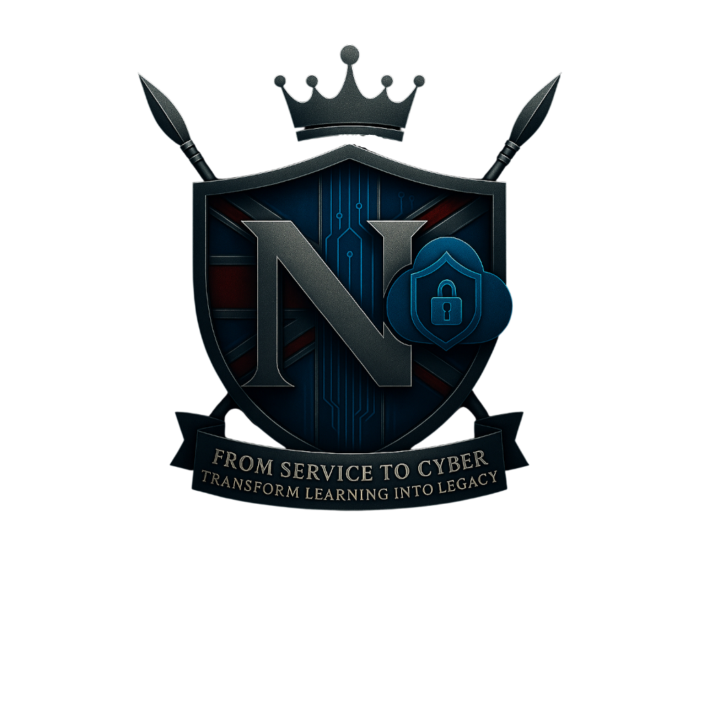

ATILS ACADEMY — Newton Solutions

From Service to Cyber. Transform Learning Into Legacy.

  

---

🎖️ Overview

ATILS Academy is the elite, military-inspired, multi-cloud & cyber training platform built by Newton Solutions.

Designed for:

Veterans transitioning to tech

Civilians seeking elite cyber discipline

Operators who want structure, clarity, and mission-based mastery

Built using:

Next.js 13+ (App Router)

Typescript

TailwindCSS

Lucide React

Modular Division Framework

Newton Solutions Crest System

Oracle Assistant (Legacy Mode)

This repository contains the complete, production-ready version of the platform’s foundation.

---

⚔️ Core Features (Live in This Build)

🎛️ Operator Dashboard

Dynamic XP progression

Rank advancement

Unlockable Divisions

Access status overview

Veteran verification framework

Sentinel upgrade indicators

---

🛡️ Division System

Each division has its own lore, crest, access rules, and mission identity:

Division	Purpose	Access

Vanguard Division	Core Cloud Architecture mastery	Open to all Operators
Phoenix Division	Veteran-exclusive access portal	Verification required
Sentinel Division	Cyber, Red Team, Blue Team, Coding Ops	Paid / Upgrade tier

---

🧠 Oracle Assistant

Fully integrated AI support:

Lesson navigation

Mission help

Tactical instructions

Operator progression tracking

Multi-mode interface

---

🔐 Access Control Infrastructure

Modular system supporting:

Veteran status

Paid tiers

Role-based access

Division locks / unlocks

Everything is wired through the UserProvider for maximum scalability.

---

📁 Project Structure

root/
│── app/
│   ├── dashboard/
│   ├── divisions/
│   ├── lessons/
│   ├── layout.tsx
│   └── page.tsx
│
│── components/
│   ├── access/
│   ├── context/
│   ├── ui/
│   └── OracleAssistant.tsx
│
│── public/
│   └── icons/
│       ├── crest-newton.png
│       ├── crest-phoenix.png
│       └── crest-sentinel.png
│
└── tailwind.config.ts

---

🧩 Tech Stack

Next.js

React

TypeScript

TailwindCSS

Lucide Icons

Context API

Modular Component Architecture

Military-grade UI styling

---

🚀 Upcoming Features

(Automatically integrated via Master Blueprint)

🔥 Phase 2 — Operator Progression Engine

XP missions

Rank unlock system

Skill Tree

Operator dossiers

Platoon & Battle Buddy features

🔥 Phase 3 — Lessons Engine 2.0

Track/Slug dynamic learning

AI-generated lessons with Oracle

Difficulty scaling

Progress saving

🔥 Phase 4 — Division Command Centers

Vanguard War Room

Phoenix Veteran Hub

Sentinel Ops Console

🔥 Phase 5 — Certificates + Portfolio Export

Auto-generated certificates

Operator portfolio builder

Project evidence export system

---

🏛️ Newton Solutions Creed

“Knowledge must be earned. Legacy must be built. Operators rise.”

---

👑 Founder

Matthew Newton — British Army Veteran
Creator of Newton Solutions
